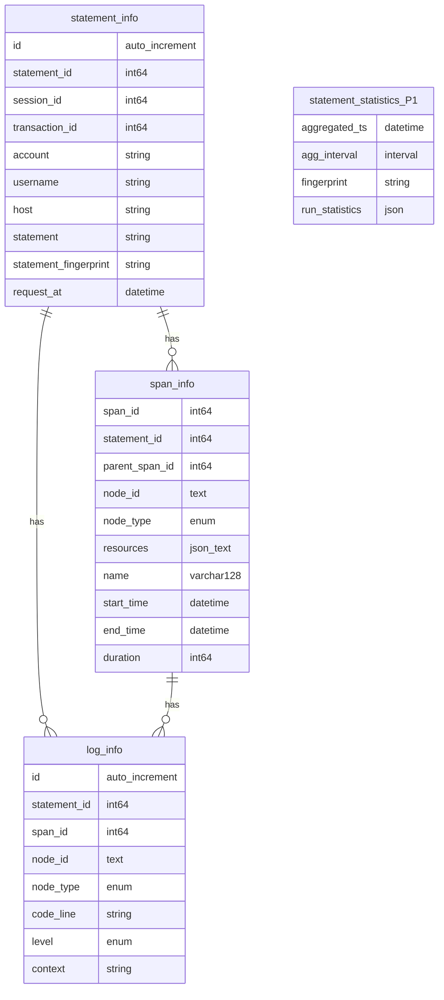

# Background
Please check [mo-ob-frm](./mo-ob-frm.md) for more details.

目标
- P0：Base Usage OK! 提供 Span 和 Log 核心功能。
- P1：Merge matric info framework / base statistics info (like table statement_statistics)


# Design
## Usage
- Startup
```go
// 'rootCtx' should be the root context of Server itself.
rootCtx, err := motrace.Init(
	trace.WithContext(context.Background()),
	trace.EnableTrace(true),
	trace.MOSqlExporter(), // optional: motrace.MOBatchExporter()
	trace.WithSampler(trace.NoopSamleper()),
	trace.DebugMode(true),		  // painc, if server shutdown with non-Ended span
)
if err != nil {
	panic(err)
}
```

- Span Record
```go
func ExampleFunc(ctx context.Context) {
	// Required: 创建一个 span，并记录开始时间
	//		parentCtx contain TraceId, and new SpanId
	parentCtx, span := trace.Start(ctx, "ExampleFunc")

  // Function Body: exec something, and must pass new context (parentCtx)
	ExampleChildFunc(parentCtx)
	
	// Required: 结束Span
	span.End()
}

func ExampleChildFunc(ctx context.Context) {
	// Required: 创建一个 span，并记录开始时间
	_, span := trace.Start(ctx, "ExampleChildFunc")

	// do something ...
	
	err := errors.New("new error msgs")
	// P1: Optional: 记录error信息
	span.RecordError(err)
	// P1: Optional: 设置Span Status
	span.SetStatus(codes.Error, err.Error())
	// P1: Optional: 记录 stats 相关数据
	span.SetAttributes(attribute.Int64("test_cost", int64(123)))

	// Required: 结束Span
	span.End()
}
```

- Shutdown
```go
// flush all trace/stats/log data to DB or Local file.
motrace.Flush(FlushOption)
```

## Core Design
### Table Schema

表`statement_info`在mo接到请求时，就需要生成记录，其中 `statement_id`，作为 trace中的`trace_id`使用
表`trace_info` 即为 trace记录的核心表，其中resource 为json字段，记录额外的记录信息
表`log_info` ，记录 log信息的核心表。
表`statement_statistics`，这是基于 statement_fingerprint 周期性统计执行信息。`run_statistics`存储的是 各阶段的统计信息，如下json展示。（Q：因为需要周期性统计，MO是否有计划提供定时器？）



- example: run_statistics

```
{
  "statistics": {
    "bytesRead": {
      "mean": 325.40425531914894,
      "sqDiff": 1420401.3191489358
    },
    "cnt": 47,
    "firstAttemptCnt": 47,
    "lastExecAt": "2022-06-09T10:46:13.963992Z",
    "maxRetries": 0,
    "nodes": [
      1
    ],
    "numRows": {
      "mean": 1,
      "sqDiff": 0
    },
    "ovhLat": {
      "mean": 2.6638297872340574e-05,
      "sqDiff": 1.0036851063829765e-08
    },
    "parseLat": {
      "mean": 0,
      "sqDiff": 0
    },
    "planGists": [
      "AgEeAgCfDQIAAAcMBgw="
    ],
    "planLat": {
      "mean": 0.001873063829787234,
      "sqDiff": 0.00025504664280851067
    },
    "rowsRead": {
      "mean": 1,
      "sqDiff": 0
    },
    "rowsWritten": {
      "mean": 0,
      "sqDiff": 0
    },
    "runLat": {
      "mean": 0.0048906808510638285,
      "sqDiff": 0.0024366159162127663
    },
    "svcLat": {
      "mean": 0.006790382978723404,
      "sqDiff": 0.0030886216651063833
    }
  }
}
```


### Main Flow

`TraceProvider` 统一管理组件的维护，数据采集主要由`Tracer`, `Span`完成，数据上报则由 `Exporter`完成。
每个节点完成采集后，各自进行数据的上报，不会存在中心节点汇总上报。
图中描述的Exporter调用的`MO::BatchWrite`为批量写入接口，是用于分布式部署场景。目前为单点模式，是直接调用SQL接口完成写入。
整体流程中需要依赖`context.Context`来传递Span的信息，对应有两部分需要进行修改：1）要记录Trace信息的函数，需增加`Context`参数；2）组件之间调用时，协议上需要增加 TraceID（同statement_id） 或 SpanID 等信息。
（注：图中标记的BatchWrite 为其中一种方案选择，主要用于表达每个节点自行更新数据）

![[otel-stats.excalidraw|600]]

### Interface

API的定义沿用 [OpenTelemetry](https://opentelemetry.io/docs/reference/specification/) 的定义。考虑到对性能的要求，此处对单独实现 `MOTrace`逻辑，精简掉Otel为了通用性引入的代码逻辑。并进行如下改造或优化：

- P0：`context.Context` 传输`TraceID/SpanID/ParentSpanID`等信息
- P0: ID Generator - crdb 有 FastInt63 @pkg/util/randutil/rand.go:122
- P0: read sys time - tidb 有 tikv 的高效 tracing, [minitrace-go](https://github.com/tikv/minitrace-go)
- P0: BatchProcessor 的 channel 选择和 Exporter 的唤醒策略，[Optimizing OpenTelemetry’s Span Processor for High Throughput and Low CPU Costs](https://doordash.engineering/2021/04/07/optimizing-opentelemetrys-span-processor/)
- P0: span/log 池管理 - crdb 做一个 pool 减少内存分配

![[otel-trace-provider.excalidraw|400]]

- [Global](https://pkg.go.dev/go.opentelemetry.io/otel)

```
func GetTracerProvider() trace.TracerProvider
func SetTracerProvider(tp trace.TracerProvider)
func Tracer(name string, opts ...trace.TracerOption) trace.Tracer
func Version() string
```

- [Tracer](https://pkg.go.dev/go.opentelemetry.io/otel/trace#Tracer)

```
type Tracer interface {
	// Start creates a span and a context.Context containing the newly-created span.
	Start(ctx context.Context, spanName string, opts ...SpanStartOption) (context.Context, Span)
}
```

- [Span](https://pkg.go.dev/go.opentelemetry.io/otel/trace#Span)

```
type Span interface {
	// End completes the Span. The Span is considered complete and ready to be
	// delivered through the rest of the telemetry pipeline after this method
	// is called. Therefore, updates to the Span are not allowed after this
	// method has been called.
	End(options ...SpanEndOption)

	// IsRecording returns the recording state of the Span. It will return
	// true if the Span is active and events can be recorded.
	IsRecording() bool

	// SpanContext returns the SpanContext of the Span. The returned SpanContext
	// is usable even after the End method has been called for the Span.
	SpanContext() SpanContext

	// SetName sets the Span name.
	SetName(name string)

	// TracerProvider returns a TracerProvider that can be used to generate
	// additional Spans on the same telemetry pipeline as the current Span.
	TracerProvider() TracerProvider
}
```


### Action

- Init

```
// Init - call motrace::Init()
1. Get server identify: node_id, node_type, server_version, ...
2. Get Regist Modules: TracePrivider, Exporter, Sampler, ...
	// Trace ON  with MOTracePrivider
	// Trace OFF with noopTracerProvider
3. Start Exporter gorouting
4. Start local-check gorouting: 处理需要重新上报的数据，来源：1）组件异常；2）shutdown遗留
```

- Start

```
// Start - call Tracer::Start(context.Context)
1. Get Span from span_pool
2. Init span’s member
3. Gen Record: startTime, TraceID, SpanID, ParentSpan
return Span
```

- End

```
// End - call Span::End()
1. Gen Record: endTime
2. call Span::OnEnd() - send to Exporter
```

- Log

```
// Log - call logger2.Infof(context.Context, formatter string, args ...any) / logger2.Errorf / ...
1. get current Span from context
2. Get Log obj from log_pool
3. Save Log info into Span
4. Write log into file
```

- Export

```
// Export - Exporter Send Data to DB
failed with retry.
if meet too much failed, flush to local file. (wait local-check gorouting handle)
```

- Flush

```
// Flush - call motrace::Flush(), should called when server normally shutdown
- normal shutdown, call Exporter to Flush all Data to DB
- fast   shutdown, flush Exporter buffer to local file
```


### Exporter

`Exporter`负责将采集的数据持久化到DB中。由于目前处于 0.5 和0.6版本过度期，`MO:BacthWrite` 接口还没有ready，因此需要先实现基于SQL接口完成的`MOSqlExporter`的逻辑。Exporter的概要设计如下。

- MOSqlExporter（P0)，基于当前的`matric_export`重构兼容 trace 和 log的使用
- MOBatchExporter（P2)，基于分布式架构，后续再调整实现。

![[collector.excalidraw|600]]


### logger2

提供日志功能，同时支持上传DB 和 本地日志。提供的接口如下

```
Info(context.Context, formatter string, args ...any)
Infof(context.Context, formatter string, args ...any)
...
```


## Plan

P0: 工作量约 4周，计划于7-29 完成。此时，开发即可正常使用Trace相关记录

P1: 预期一个月内完成。

| stage | work                                                         | man_day | owner  |
| ----- | ------------------------------------------------------------ | ------- | ------ |
| P0    | Base Usage OK!                                               |         |        |
|       | - All core-flow need support `context.Context` param         | -       | ?      |
|       | - Span start/end is ready（MO needs have its own Trace/Span implement ) | 5       | 谢泽雄 |
|       | - Exporter ready for singlton mode                           | 5       | 韩枫   |
|       | - MO startup/shutdown ok with mo.Init(), mo.Flush()          | 3       | 谢泽雄 |
|       | - MO statment execution need session_id/transaction_id       | -       | ?      |
|       | - Logger support upload log into db, with context.Context    | 5       | 谢泽雄 |
|       | - Unit-test                                                  | 5       | 谢泽雄/韩枫   |
| P1    | Merge matric info framework / base statistics info (table statement_statistics) |         |        |
| P2    | Performance                                                  |         |        |


# 待定/TODO
1. 分布式后，实现 MOBatchExporter 批处理逻辑
2. 根据多租户隔离调整库表结构
3. Error Framework
4. 表`statement_statistics`定期计算的功能不一定要由DB完成，可以由平台进行定期计算。